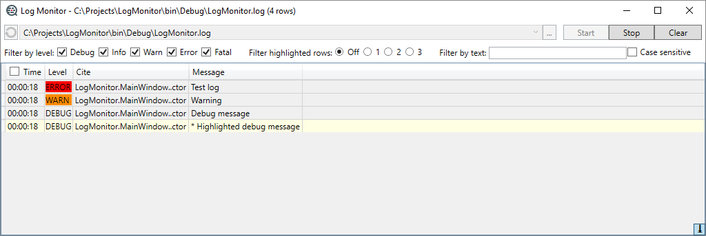

LogMonitor
==========

Real-time monitoring tool for log files.



Usage
=====

Default launch of monitor for first saved file:
```
LogMonitor.exe
```

Launch and run real-time monitoring for first saved file:
```
LogMonitor.exe -run
```

Launch and run real-time monitoring for file c:\Your app\app.log:
```
LogMonitor.exe -run "c:\Your app\app.log"
```

Launch with checked levels and highlighted lines:
```
LogMonitor.exe -levels=Debug,Error,Fatal -highligh=1
```

Settings
========

Settings stored in ```LogMonitor.exe.config``` file in ```MonitorSection``` section.
```
  <MonitorSection>
    <SavedLogs>
      <add log="C:\MyProject\MyProject.txt"/>
      <add log="C:\AnotherProject\Project.log" mapping="another" autostart="true"/>
      <add log="C:\AnotherProject\Project.log" mapping="another"/>
      <add log="C:\AnotherProject\Project.log" mapping="another" filterLevels="Debug,Error,Fatal" filterHighlight="1" filterText="NullReference"/>
    </SavedLogs>

    <Window width="1920" height="350" monitor="2" position="Bottom"/>

    <LevelColors>
      <add level="Debug" color="Transparent"/> <!-- or #00FFFFFF -->
      <add level="Info" color="GreenYellow"/>
      <add level="Warn" color="DarkOrange"/>
      <add level="Error" color="Red"/>
      <add level="Fatal" color="BlueViolet"/>
    </LevelColors>

    <ColumnMapping name="default" separator="|" default="true">
      <columns>
        <Column header="Time" type="Time"/>
        <Column header="Level" type="Level"/>
        <Column header="Cite of code" path="Cite"/>
        <Column header="Message" type="Message"/>
      </columns>
    </ColumnMapping>
    <ColumnMapping name="wix" pattern="MSI \(c\) \((.*?)\) \[(.*?)\]: (.*)$">
      <columns>
        <Column header="Code"/>
        <Column header="Time" type="Time"/>
        <Column header="Message" type="Message"/>
      </columns>
    </ColumnMapping>
  </MonitorSection>
```

SavedLogs
---------
**mapping**: one of saved column mappings.

**autostart**: run monitoring after open log file.

**filterLevels**: filter lines for this checked levels.

**filterHighlight**: filter lines where text starts of highlighting symbols (```*``` or ```#```). This symbols may be used for highlight lines for debug purpose.

**filterText**: filter lines for text.
```
  <MonitorSection>
    <SavedLogs>
      <add log="C:\MyProject\MyProject.log"/>
      <add log="C:\AnotherProject\Project.txt" mapping="another" autostart="true"/>
      <add log="C:\AnotherProject\Project.txt" mapping="another"/>
      <add log="C:\AnotherProject\Project.txt" mapping="another" filterLevels="Debug,Error,Fatal" filterHighlight="1" filterText="NullReference"/>
    </SavedLogs>
```
Window config
-----
**Monitor**: Number of startup monitor (>=1). Defaults to zero (window shows at monitor where mouse point shown).

**Position types**: vertical position of window on screen. Values: Center, Top, Bottom. Default: Center

**Width** and **height**: SIze of window on screen.
```
    <Window width="1920" height="350" monitor="2" position="Bottom"/>
```

Level colors
-----
Customize colors of log level.
```
    <LevelColors>
      <add level="Debug" color="Transparent"/> <!-- or #00FFFFFF -->
      <add level="Info" color="GreenYellow"/>
      <add level="Warn" color="DarkOrange"/>
      <add level="Error" color="Red"/>
      <add level="Fatal" color="BlueViolet"/>
    </LevelColors>
```

Column mappings
-----
The mappings of columns for various formats of log.

**Mapping mode**: line format mode - ```separator``` or ```pattern```.

**Column types**: Text, Time, Level, Message, Skip. Default: Text

```
    <ColumnMapping name="default" separator="|" default="true">
      <columns>
        <Column header="Time" type="Time"/>
        <Column header="Level" type="Level"/>
        <Column header="Cite of code" path="Cite"/>
        <Column header="Message" type="Message"/>
      </columns>
    </ColumnMapping>
    <ColumnMapping name="wix" pattern="MSI \(c\) \((.*?)\) \[(.*?)\]: (.*)$">
      <columns>
        <Column header="Code"/>
        <Column header="Time" type="Time"/>
        <Column header="Message" type="Message"/>
      </columns>
    </ColumnMapping>
```